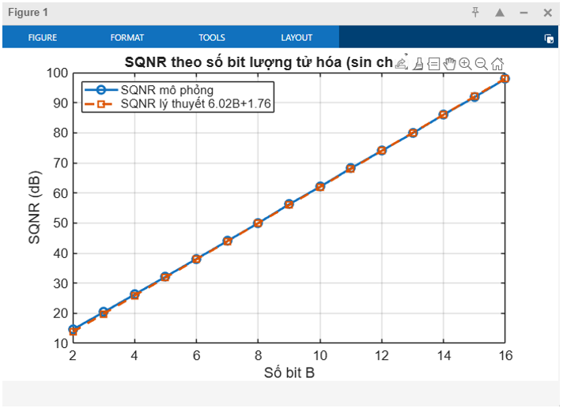

# matlab-dsp-quantization-analysis
MATLAB simulations analyzing ADC quantization noise, SQNR, and FFT spectrum in Digital Signal Processing.

# DSP Quantization & Noise Analysis via MATLAB

A comprehensive Digital Signal Processing (DSP) project simulating the effects of quantization and quantization noise using MATLAB. This project visually and mathematically investigates how bit-depth resolution in Analog-to-Digital Conversion (ADC) impacts signal fidelity, Mean Squared Error (MSE), and the frequency-domain noise floor.

---

##  Project Overview

In digital systems, continuous analog signals must be digitized (quantized) into discrete levels, inherently introducing quantization error ($e[n] = x[n] - x_q[n]$). This project explores this phenomenon through three core MATLAB simulations to verify standard DSP theorems.

### 1. Sine Wave: SQNR vs. Bit Depth
Simulated a uniform mid-tread quantizer on a standard sine wave to evaluate the Signal-to-Quantization-Noise Ratio (SQNR). 
* **Result:** Successfully verified the theoretical DSP formula: $SQNR \approx 6.02B + 1.76 \text{ (dB)}$, demonstrating that each additional bit yields roughly a 6 dB improvement in signal-to-noise ratio.

### 2. Ramp Signal: Staircase Distortion & MSE
Applied quantization to a linear ramp signal to explicitly visualize "staircase distortion" at lower bit depths (e.g., 4-bit).
* **Result:** Computed the Mean Squared Error (MSE) to show its exponential decay as bit resolution increases from 4-bit to 16-bit, confirming the variance model $\sigma_e^2 = \frac{\Delta^2}{12}$.

### 3. FFT Analysis of Quantization Noise
Performed Fast Fourier Transform (FFT) to analyze the frequency spectrum of the quantization error across 4-bit, 8-bit, and 16-bit systems.
* **Result:** Demonstrated that low bit-depths generate distinct spurious harmonic tones, whereas high bit-depths (16-bit) smooth out the error into a uniform, flat "white noise" floor dropping below -150 dB.

---

##  Simulation Gallery

*(Add your MATLAB exported plots here)*

| SQNR vs. Bit Resolution | Ramp Staircase Distortion | FFT Noise Spectrum |
| :---: | :---: | :---: |
|  |  |  |

---

## My Contributions

As a core member of this DSP research project, my specific responsibilities focused on the mathematical and theoretical foundation of the system:

* **Theoretical Modeling:** Researched and established the mathematical formulas governing analog-to-digital quantization, modeling the quantization step ($\Delta$), Mean Squared Error (MSE), and the theoretical limits of SQNR.
* **Algorithm Analysis:** Analyzed the behavior of quantization error in both the time domain (staircase effect) and the frequency domain (white noise distribution vs. harmonic distortion).
* **Technical Documentation:** Authored and formatted the comprehensive academic engineering report, bridging the gap between theoretical DSP concepts and the empirical data generated by the MATLAB simulations.

---

##  Tools & Technologies
* **Environment:** MATLAB
* **Key DSP Concepts:** Uniform Quantization, Fast Fourier Transform (FFT), Signal-to-Noise Ratio (SNR/SQNR), Signal Sampling, Noise Floor Analysis.
