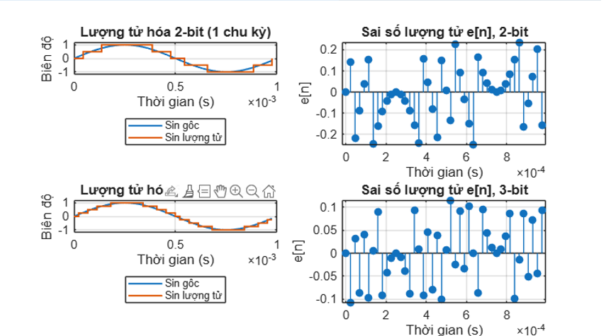
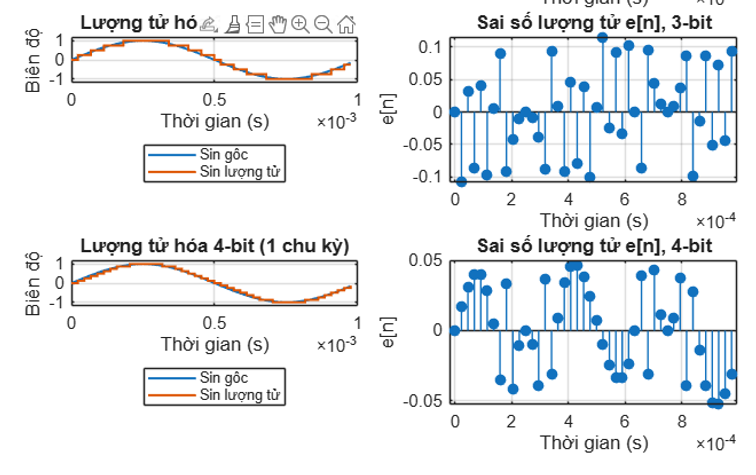
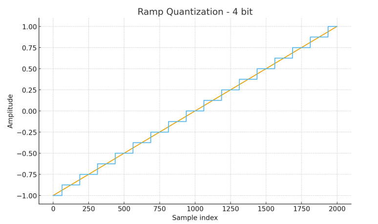
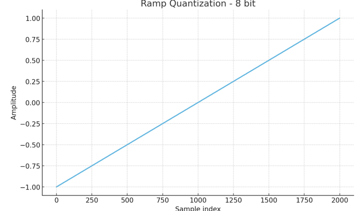
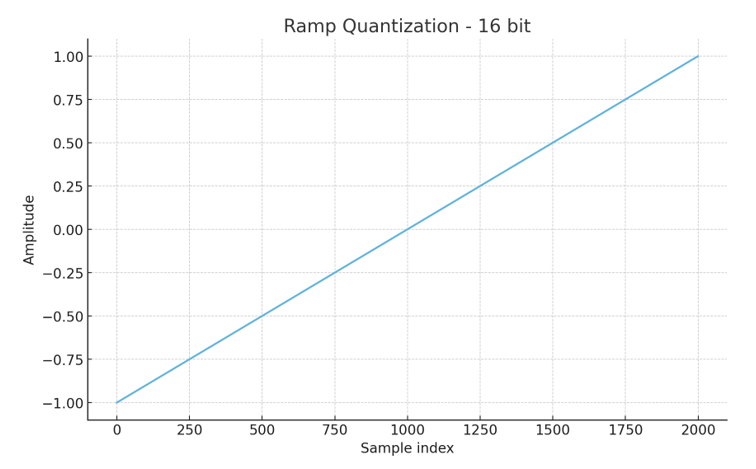
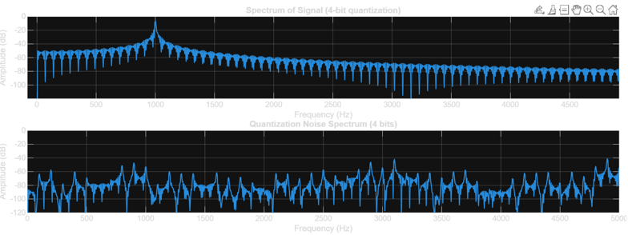
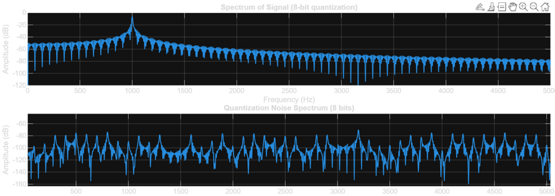
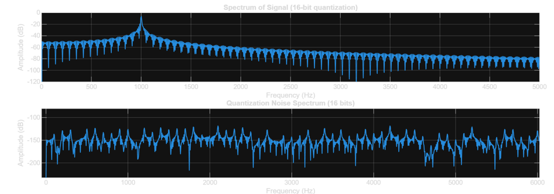

# matlab-dsp-quantization-analysis
MATLAB simulations analyzing ADC quantization noise, SQNR, and FFT spectrum in Digital Signal Processing.

# DSP Quantization & Noise Analysis via MATLAB

This project explores the empirical effects of ADC quantization on signal integrity. Through MATLAB simulations, I validated standard DSP theorems regarding quantization noise, SQNR, and the transition of quantization error into white noise across time and frequency domains.

---

## Simulation Overview

## Part 1: SQNR vs. Bit Depth Analysis (Sine Wave)
I simulated a 1kHz sine wave sampled at 44.1kHz to observe how bit resolution impacts signal fidelity.
* **Findings:** Validated the "6dB per bit" rule ($SQNR \approx 6.02B + 1.76$ dB). Every bit added consistently reduced the noise floor, confirming the linear relationship between bit depth and signal fidelity.
### Simulation 1: Time-Domain & SQNR
| SQNR vs. Bit Depth | 2-Bit Quantization & Error | 4-Bit Quantization & Error |
| :---: | :---: | :---: |
|  |  |  |

---

## Part 2: Staircase Distortion & Mean Squared Error (MSE)
Using a linear ramp, I visualized the discretization process.
* **Observations:** At 4-bit resolution, the signal is a coarse staircase. At 16-bit, it is virtually indistinguishable from the analog input.
* **Math Validation:** The calculated Mean Squared Error (MSE) aligns with the uniform distribution model $\sigma_e^2 = \frac{\Delta^2}{12}$.
### Simulation 2: Ramp Signal Distortion
| 4-Bit Ramp Distortion | 8-Bit Ramp Distortion | 16-Bit Ramp Distortion |
| :---: | :---: | :---: |
|  |  |  |

---

## Part 3: Frequency Domain Analysis (FFT Spectrum)
This study analyzes how quantization error presents in the frequency domain.
* **Harmonic Distortion:** At low bit depths (4-bit), the error appears as clear harmonic spikes.
* **White Noise Transition:** As resolution increases (16-bit), these harmonics vanish, and the error behaves like ideal, flat white noise.

### Simulation 3: FFT Noise Floor
| 4-Bit FFT Spectrum | 8-Bit FFT Spectrum | 16-Bit FFT Spectrum |
| :---: | :---: | :---: |
|  |  |  |

---

## Tools & Concepts
* **Environment:** MATLAB
* **Core DSP Concepts:** Uniform Quantization, Fast Fourier Transform (FFT), Signal-to-Quantization-Noise Ratio (SQNR), Mean Squared Error (MSE), Sampling Theory, Noise Floor Analysis.
